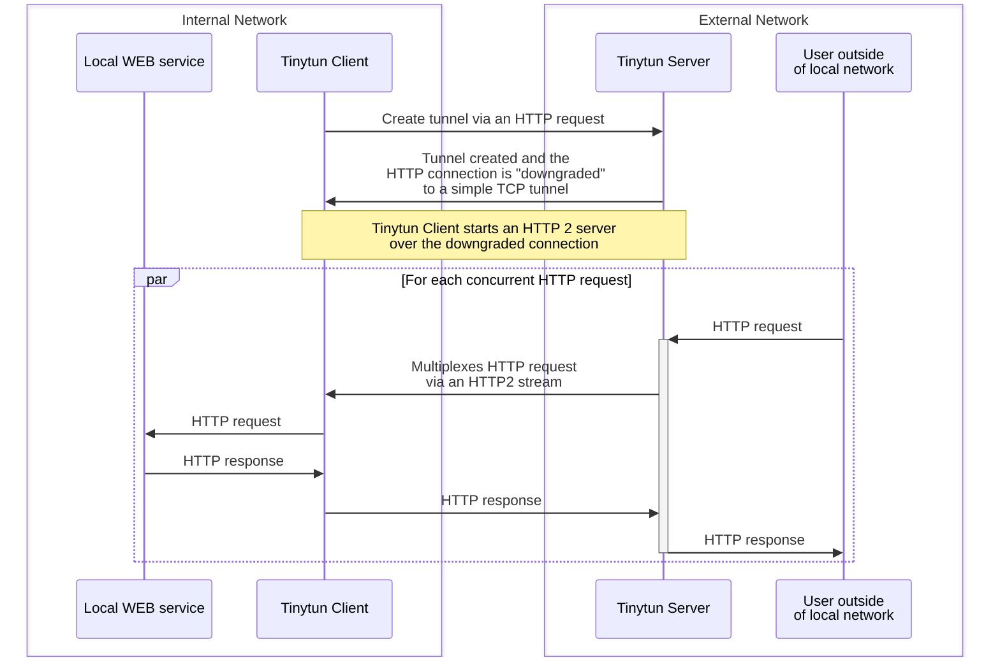

# tinytun
Generate public URLs for your locally running web servers. Simple clone of ngrok.

```mermaid
sequenceDiagram

participant Local WEB service
participant TinytunClient as Tinytun Client
participant TinytunServer as Tinytun Server
participant User as User outside<br/>of local network

box transparent Internal Network
    participant Local WEB service
    participant TinytunClient
end

box transparent External Network
    participant TinytunServer
    participant User
end

TinytunClient->>TinytunServer: Create tunnel via an HTTP request
TinytunServer->>TinytunClient: Tunnel created and the<br/>HTTP connection is "downgraded"<br/>to a simple TCP tunnel
note over TinytunClient,TinytunServer: Tinytun Client starts an HTTP 2 server<br/>over the downgraded connection

par For each concurrent HTTP request
    User->>+TinytunServer: HTTP request
    TinytunServer->>TinytunClient: Multiplexes HTTP request<br/>via an HTTP2 stream
    TinytunClient->>Local WEB service: HTTP request
    Local WEB service->>TinytunClient: HTTP response
    TinytunClient->>TinytunServer: HTTP response
    TinytunServer->>-User: HTTP response
end
```
