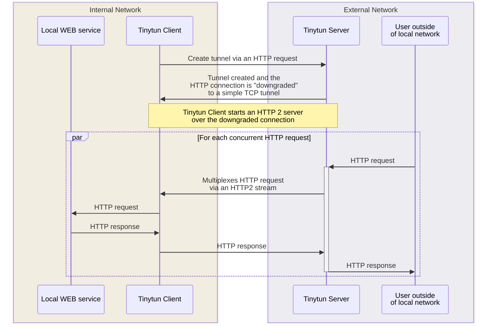

# tinytun

Expose your local web servers to the internet. A simple, self-hostable tunneling tool written in Rust.

## How it works

The client opens an HTTP `CONNECT` request to the server, which upgrades the connection to a raw TCP stream. An HTTP/2 session is then established over this stream, allowing the server to multiplex many concurrent requests to the client through a single connection.



## Installation

### Using Nix

```sh
nix profile install github:reu/tinytun
```

### From source

```sh
cargo install --git https://github.com/reu/tinytun tinytun-client
```

## Usage

### HTTP tunnel

Forward HTTP traffic to a local server running on port 3000:

```sh
tinytun http 3000
```

This will print a public URL like `https://abc123.tinytun.com` that forwards to `localhost:3000`.

You can request a specific subdomain:

```sh
tinytun http 3000 --subdomain myapp
```

### TCP tunnel

Forward raw TCP traffic to a local port:

```sh
tinytun tcp 8080
```

You can request a specific remote port (must be in the 20000-60000 range):

```sh
tinytun tcp 8080 --port 30000
```

### Options

```
Usage: tinytun <TUNNEL_TYPE> <LOCAL_PORT> [OPTIONS]

Arguments:
  <TUNNEL_TYPE>   Tunnel type [possible values: tcp, http]
  <LOCAL_PORT>    Local web service port

Options:
  -s, --subdomain <SUBDOMAIN>      Subdomain to use (HTTP tunnels)
  -p, --port <PORT>                Remote port to use (TCP tunnels, 20000-60000)
  -c, --concurrency <CONCURRENCY>  Max concurrent connections [default: 100]
  -h, --help                       Print help
  -V, --version                    Print version
```

### Custom server

By default the client connects to `tinytun.com`. To use your own server, set the `TINYTUN_SERVER_URL` environment variable:

```sh
TINYTUN_SERVER_URL=https://my-server.example.com:5554 tinytun http 3000
```

## Self-hosting

### Docker

```sh
docker build -t tinytun-server .
docker run -p 5554:5554 -p 80:5555 -p 443:5555 tinytun-server
```

### Configuration

The server is configured via environment variables:

| Variable | Default | Description |
|---|---|---|
| `CONNECTION_PORT` | `5554` | Port for client tunnel connections |
| `PROXY_PORT` | `5555` | Port for HTTP proxy (public traffic) |
| `TCP_PROXY_PORT` | `5556` | Port for TCP proxy |
| `METADATA_PORT` | `5553` | Internal metadata API port |
| `BASE_DOMAIN` | `local.tinytun.com` | Base domain for subdomain routing |
| `RUST_LOG` | | Log level filter (e.g. `tinytun_server=info`) |

## Project structure

| Crate | Description |
|---|---|
| `tinytun` | Core library &mdash; tunnel client and H2 stream implementation |
| `tinytun-client` | CLI binary (`tinytun`) |
| `tinytun-server` | Server binary and HTTP/TCP proxy logic |

## License

MIT
